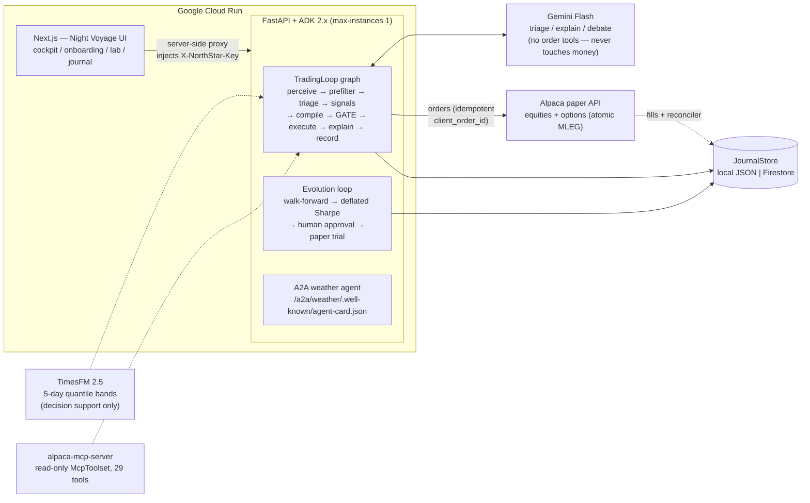

# NorthStar ✦ — set the star, we sail the boat

A goal-first, self-evolving, hard-gated trading copilot for people who think in
**"grow $100k to $110k in a year"**, not in greeks. Built on **Google ADK 2.x +
Gemini** for orchestration and judgment, and **Alpaca** for real (paper) options
& equities execution.

> Paper trading only. Simulated money, live market data. Probabilities are
> historical estimates, never promises. Not investment advice.

## Why it's different

1. **Goal-first, honesty-first.** You state a destination; NorthStar translates
   it into required return, runs real backtest distributions + Monte Carlo, and
   tells you the odds — including a red **"this is unrealistic, here's what
   would actually work"** path. If boring SPY beats us, we say so.
2. **LLMs never touch the money path.** Gemini triages events, explains
   decisions in plain language, and proposes strategy improvements. Orders are
   compiled, risk-gated, and executed by deterministic, unit-tested code.
   Every AI trade idea must survive an explicit **bull-vs-bear debate**
   (Disagree-or-Commit, after FinCom 2026): a critic model red-teams the exact
   trade; a strong objection kills it, and the judge is code, not a third LLM.
3. **A risk gate that cannot be sweet-talked.** 17 pure-function checks (max
   loss per trade, concentration, per-family sleeve budgets, CSP collateral
   caps, circuit breakers, naked-call ban, duplicates, liquidity,
   market-weather floor, kill switch). Every rejection is a first-class journal
   record with a reason code. Closing orders are recognized (`meta.closing`)
   and never blocked by new-risk rules — only the kill switch outranks an exit.
   The cockpit has a per-position Close button (options close as their whole
   structure — never a naked leg left behind), and even that manual order
   passes through the gate. Underneath: one global pass mutex, atomic approval
   decisions, idempotent `client_order_id`s at the broker, and a fill
   reconciler that back-fills orders filled outside a live pass — double
   orders and silent fills are designed out, not hoped away.
4. **Evolution with scientific hygiene.** Gemini Pro (or a labeled grid
   fallback) proposes candidates → walk-forward backtest (OOS only decides,
   deflated by the Bailey/López de Prado expected-max-Sharpe haircut) →
   **a human approves** → a 3-day small-allocation paper trial → promotion only
   after a clean window. Full lineage: parent version, hypothesis, experiment.
5. **Everything explains itself.** The Voyage Journal is an append-only lineage
   of proposal → verdict → order → fill → realized P&L → digest, in plain English.
6. **It runs the boring hours too.** Options exit manager (50% profit take,
   DTE≤7 step-out, spreads closed as one atomic multi-leg order), approval
   timeouts that actually auto-reject, and a night watch that settles trials,
   runs evolution rounds, recomputes goal odds, summarizes the weather day and
   records the equity curve — while you sleep.
7. **A research flywheel, not just an execution loop.** Every night the fleet
   re-targets itself: a **Scout** scans the whole market (screener boards →
   liquidity floor → deterministic factor scores, one plain-English reason per
   pick) and an options lens ranks the best delta-band put yields; a **factor
   screener** grades 13 known factors by cross-sectional rank-IC and may tilt
   the scout's weights (±20%, journaled); a **Market Compass** classifies the
   regime deterministically and buckets each crew's walk-forward record by that
   weather (refusing conclusions under 120 in-bucket days); a **Helm Advisor**
   occasionally proposes a bounded, reversible sleeve tilt — adopt/dismiss is
   yours, and dismissed advice is still scored (counterfactual ledger); the
   **Shipyard** designs whole new strategies as validated factor-blend specs
   (a restricted DSL, never generated code) and walk-forward tests them; a
   **factor mine** searches restricted expressions with an IC bar that rises
   with every lifetime try (expected-max deflation), human-gated into a
   library the shipyard can design with; a **forecast scorecard** grades
   TimesFM's bands against what actually happened; and the **Captain's Log**
   narrates the day from journaled facts. Evolution itself is
   **goal-conditioned**: with an active plan, candidates are selected by the
   probability of reaching *your* target (Monte Carlo on OOS returns, risk-tier
   drawdown penalty) with the deflated-Sharpe rule kept as a statistical floor.

## Architecture



Gold path to remember: **only the deterministic GATE node can reach the
order-placing code, and only code sits between GATE and Alpaca.** Gemini
proposes and narrates; it holds no order tools.

- **Strategies (runnable today):** Wheel/CSP/CC, three defined-risk spreads
  (bull put / bear call / iron condor, atomic MLEG), Momentum Top-N, RSI
  reversion, MA cross — plus an **AI Analyst** (bull/bear Gemini debate with
  Disagree-or-Commit; at most one sized-by-our-code trade; silent without a
  key). Unimplemented catalog entries are honestly labeled "coming soon",
  never faked.
- **Exit manager:** short-premium structures are closed mechanically at 50%
  captured credit or 7 DTE, before any new trade is considered each pass.
- **Realized P&L:** exact on our own closing fills; expiry/assignment inferred
  closes are booked as labeled estimates. Loss streaks feed the cooldown gate.
- **Goal Planner:** momentum = real 4y walk-forward backtest; wheel = labeled
  volatility-based approximation (Alpaca options history starts Feb 2024);
  bootstrap Monte Carlo → probability, bands, median max drawdown. Odds are
  recomputed nightly from live equity.
- **Market weather:** 3-source 0-100 index (SPY realized vol, Alpaca headline
  tone, GDELT global tone) gates NEW risk in storms; validated by an honest
  walk-forward study on the Research workbench (vol proxy, labeled). Also exposed as an
  **A2A agent** (`/a2a/weather/.well-known/agent-card.json`): any A2A client
  can discover it and query the exact reading our risk gate consumes —
  deterministic, no LLM per query.
- **TimesFM forecasts:** Google's time-series foundation model (zero-shot)
  draws 5-day quantile bands (q10/q50/q90) for every traded symbol nightly.
  Decision support only — it feeds the AI analyst's fact sheet and a cockpit
  fan chart, never an order trigger.
- **Glass-box passes:** every ADK pass journals a node-by-node trace (wall
  time per node, which nodes used Gemini vs template); the cockpit renders the
  live workflow graph — agentic UX means you can audit the loop, not trust it.
- **HITL:** soft breaker / cooldown / storm weather / evolution promotions
  create approval cards; pending ones expire to auto-reject on a timer. The
  loop never blocks on a human.
- **Performance:** `scripts/tearsheet.py` renders `docs/TEARSHEET.md` from
  broker-reported equity plus the journal's realized-P&L attribution; the
  night watch also files a one-page markdown daily report (equity, trades,
  regime, scout highlights, captain's log) at `GET /api/report/daily`.
- **Research flywheel surfaces:** the Research workbench has four tabs —
  Radar (Scout report with options watch + Captain's log), Compass (regime
  badge, weather line, conditional per-family stats, Advisor adopt/dismiss,
  TimesFM forecast), Evolution (evolution rounds, promotion candidates,
  weather-floor validation, DSL Shipyard), Mining (Factor radar rank-IC table
  + Factor mine with library decay flags); tabs show an amber dot when a
  decision waits. The cockpit keeps a compact overnight-research digest in
  the rail (goes gold when helm advice waits); the ribbon shows a regime
  chip. Every loop degrades honestly and can be disabled per-flag (see
  `.env.example`).

## Run it

```powershell
# 1) secrets
Copy-Item .env.example .env   # fill in Alpaca PAPER keys (PK...), optional GOOGLE_API_KEY

# 2) backend (Python 3.12, uv)
cd apps/api; uv sync; cd ../..

# 3) frontend (Node 22)
cd apps/web; npm install; cd ../..

# 4) both dev servers (API :8800, Web :3000)
.\scripts\dev.ps1

# smoke test + one full loop pass
.\scripts\smoke.ps1
# then in the UI: Cockpit -> Helm -> "Run one pass now"
```

Tests: `cd apps/api; uv run pytest` (risk gate, compiler, copy-honesty lint).

Deploy (Cloud Run + Firestore): `.\scripts\deploy.ps1 -ProjectId <gcp-project>`

## Hackathon mapping

- **Google "All Things Agentic"**: ADK 2.x `Workflow` graphs orchestrate the
  trading loop *and* the evolution lab; **Gemini 3.7 Flash** (GA 2026-08-13,
  with an automatic fallback chain) powers triage, debate, explanation and
  proposals; the weather station is an **A2A-discoverable agent**; **TimesFM**
  (Google Research) draws the forecasts; HITL approval cards; Cloud Run +
  Firestore deployment.
- **Alpaca "AI Trading Agents"**: options-first strategies (CSP/CC/wheel) with
  delta/DTE/liquidity-aware contract selection via the options chain API,
  real paper orders with confirmations, P&L operated on a dedicated account.

## Evaluation rigor

The 2026 survey of LLM trading systems (arXiv:2603.27539) lists five pervasive
evaluation failures that can flip reported returns. Where NorthStar stands:

| Failure mode | NorthStar's answer |
|---|---|
| Look-ahead bias | Walk-forward splits; only out-of-sample decides promotion |
| Survivorship bias | Fixed whitelisted universe, no retroactive symbol picks |
| Backtest overfitting | Deflated Sharpe (expected-max haircut by trials-in-family) |
| Transaction cost neglect | Costs modeled in every backtest; paper fills are real |
| Regime-shift blindness | Weather gate + 3-day paper trial before any promotion |

## Honesty ledger (what's real vs approximated)

| Thing | Status |
|---|---|
| Paper orders, fills, positions | Real (Alpaca paper API) |
| Momentum backtest | Real daily bars, 4y, costs modeled, walk-forward OOS |
| Wheel backtest | Labeled approximation (realized-vol premium model) |
| Achievement probability | Bootstrap MC over the above, shown with bands |
| Realized P&L on our fills | Exact (entry basis + fill price) |
| Realized P&L on expiry/assignment | Labeled estimate (no fill existed) |
| Weather-floor validation | Vol-only proxy, walk-forward, labeled (incl. negative results) |
| Sharpe deflation | Bailey/López de Prado expected-max haircut (Lo std error) |
| TimesFM forecasts | Zero-shot quantile bands; decision support only, never an order trigger |
| AI debate | Bull/bear are Gemini; the commit/drop judge is deterministic code |
| Gemini nodes without a key / on 429/503 | Fallback chain, then honest templates; journal says `llm: false` |
| Live trading | Refused by construction (`ALPACA_PAPER` must be true) |
