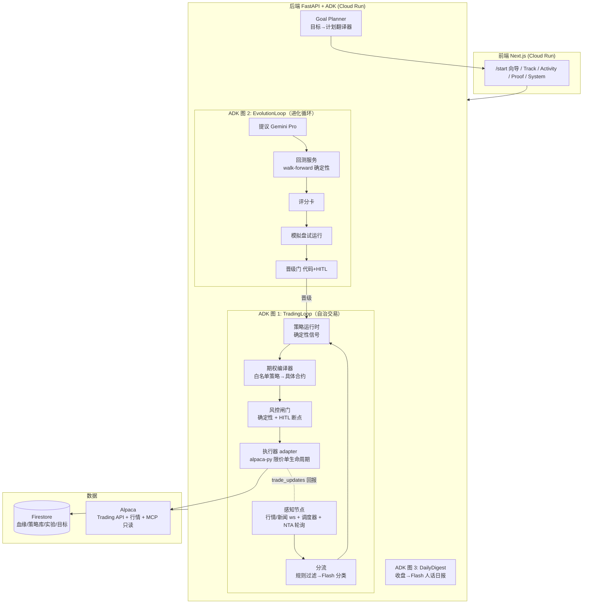

# NorthStar — 技术方案与技术栈

> 状态：v1，2026-08-30。本文件是工程事实的唯一 owner：赛规映射、架构、关键决定、领域契约、闸门规则、数据与密钥、repo 结构。

## 0. 赛规映射（硬性要求 → 技术选择）

| 要求 | 选择 | 备注 |
|---|---|---|
| Gemini 3.5+ | Gemini API：**Flash**（分流/人话解释/日报）+ **Pro**（进化提议、AI 研判） | 成本分级用模 |
| ≥1 Google Agent 框架 | **ADK Python 2.x**（2.0 GA 2026-05；图执行引擎） | 确定性节点+LLM 节点混排、原生 HITL 断点、RetryConfig |
| ≥1 GCP 服务 | **Cloud Run**（前后端容器）+ **Firestore**（血缘/策略库/状态） | Pub/Sub 可选，v1 用进程内异步队列 |
| Alpaca Trading API | **alpaca-py**（执行与数据 SDK） | 比赛专用 paper 账户 $100k |
| MCP Server 或 CLI | **官方 alpaca-mcp-server V2** 以只读工具集挂给 LLM 节点（`ALPACA_TOOLSETS=stock-data,options-data,news,account`，不含 trading）+ 运维台 | 执行器做成 adapter，若评委要求执行也经 MCP/CLI，一天内可切（见 D2） |
| 全策略含期权 | 默认组合以 Wheel/价差为主力 | 期权编译器见 §4 |

## 1. 系统架构



继承上一轮方案的分层原则：**LLM 出观点，代码下单；闸门是代码不是提示词；LLM 工具清单里没有 place_order。**

## 2. 关键架构决定（决定 / 理由 / 最强替代 / 失效条件）

**D1 · 策略 = 确定性程序；LLM 只有三个用途。**
提议者（进化循环）、AI 研判策略（14 个策略之外的一个展示型策略，单 Gemini 管线：分析→质疑→风险三步）、解释器（人话翻译）。
理由：可回测性、成本、专业量化惯例（策略必须是可复现程序）。
最强替代：每笔交易全走多 Agent LLM 辩论（上一轮的"脑子"）——被降级，因为不可回测、成本高、5 天窗口内不可校准。
失效条件：demo 反馈"AI 感不足"时，把 AI 研判策略在叙事中前置（不改架构）。

**D2 · 执行走 alpaca-py，MCP 承担数据面与运维台；执行器为 adapter。**
赛规字面是"使用 Trading API + MCP Server 或 CLI"——我们同时使用 Trading API（执行）与 MCP Server（LLM 数据工具+运维），满足要件。若组委严格解释为"执行必须经 MCP/CLI"，`Executor` 是接口，切换 `McpExecutor`/`CliExecutor` 实现即可（预算 1 天内）。

**D3 · 回测双轨（诚实边界）。**（2026-08-30 修正：不用 vectorbt，改 **pandas/numpy 纯向量回测**——numba 对新 Python 的兼容风险不值得在窗口期内赌；日线简单规则百行内更确定。）
股票策略：pandas 向量回测全历史（IEX 日线，4 年，5bps 成本，walk-forward OOS 决策）。
期权策略：**Alpaca 期权历史数据自 2024-02 起**（[官方文档](https://docs.alpaca.markets/us/docs/historical-option-data)，indicative 源，免费档延迟 15 分钟）——2024-02 之后用真实数据回测；更早期间用标的 OHLC + Black-Scholes 近似估权利金（到期 payoff 精确、中途 mark 近似、IV 用常数或 VIX 代理），**所有近似在报告中显式标注**。EOD 策略对 15 分钟延迟不敏感（声明）。

*D3 复核（2026-08-31，触发：是否改用公认专业回测框架）——维持自研核心，理由更强了。* 2026 年格局：backtrader 自 2023 冻结（排除）；vectorbt 开源版进维护模式、活跃开发在付费闭源 PRO（~$25/mo）；NautilusTrader 是唯一活跃的生产级引擎，但其价值在事件驱动的成交仿真与 backtest→live 同码（日线股票策略场景公认"机器多于问题"），迁移=按它的数据模型重写全部策略与 evolution/DSL/weather 管线，且数字漂移会打断已存实验分数与晋级门的可比性。本系统的"专业性"在方法论层且已实现：walk-forward 无 OOS 调参、Bailey-López de Prado 缩水 Sharpe、换手成本、SPY 基线、诚实 data_note。执行仿真层只需日线 close-to-close + bps 成本，~300 行 pandas 已覆盖并有 characterization tests。针对性优化（同日落地）：`monte_carlo_goal` 从 iid 抽样升级为 **Politis-Romano 平稳块抽样**（mean block 3 个月，`mean_block=1` 即退化为旧 iid 行为），目标概率不再低估连亏/连赢的序列风险；返回载荷新增 `method` 字段。失效条件（重开本决定）：转日内/实盘执行保真需求 → NautilusTrader；宇宙 >100 名或大规模参数扫描 → vectorbt PRO；期权全历史精确回测规模化 → 专用期权回测层。

*执行约定声明（2026-08-31 专业审查补记）。* 全部股票族回测按**信号日收盘成交**约定计账（RSI 显式 `shift(1)`，momentum 以 `mom.iloc[i-1]` 定第 `i` 日权重——数学等价），无前视；实盘则是次日晨 mid 限价 + 90 秒不追单，两者之间存在隔夜漂移差与 mid 限价成交率损耗。该差异对日线慢信号量级很小，但方向上回测略乐观——解读回测数字时把它记在心里，不做数字修饰。

**D4 · ADK 图（实现现状，2026-08-30）。**
**TradingLoop = ADK 2.8 `Workflow` 七节点图**（perceive → prefilter → triage[Flash] → signals → compile_gate_execute → explain[Flash] → record），确定性步骤=function 节点，LLM 步骤在节点内调 google-genai 并带诚实降级（无 key 时 journal 标 `llm:false`）。人话日报由 explain 节点承担（原 DailyDigest 图并入）。EvolutionLoop 当前为确定性服务（提议→walk-forward→评分→审批），HITL 用产品自身的审批卡（超时=拒绝）而非阻塞式 workflow 断点——调度循环不能被人挂起 12 小时。若时间允许可把 Evolution 也包成第二个 ADK 图（叙事增强，非功能必需）。

**D5 · 单容器 modular monolith + Firestore。**
黑客松不拆微服务；进程内异步队列代替 Pub/Sub（接口留好，需要凑 GCP 服务清单时可加）。

**D6 · AlpacaTradingAgent 为可选增强（非 v1 依赖）。**
它是 LangGraph 的 EOD 多 Agent 框架（股票+加密，不做期权）。若 G 里程碑提前完成，用子进程/A2A（ADK `RemoteA2aAgent` ↔ `to_a2a()`）桥接为"深度研判"信号源，输出收敛到 `TradeProposal` 契约。56 小时内全量集成风险高，明确不承诺。

## 3. 领域对象与核心契约

对象：`Goal`、`Plan`、`StrategyInstance`（含 version + lineage）、`Signal`、`TradeProposal`、`OrderPlan`、`GateVerdict`、`EvolutionExperiment`、`JournalEvent`。同一事实一个 owner，全部落 Firestore，Journal 只追加。

```jsonc
// TradeProposal —— 任何来源（策略运行时/AI 研判/人工）都收敛到此契约
{
  "id": "tp_...", "source": "strategy:wheel_v2 | ai_analyst | human",
  "underlying": "NVDA", "direction": "neutral_bullish",
  "strategy_type": "cash_secured_put",          // 必须在白名单内
  "conviction": 0.64, "horizon_days": 30,
  "thesis_human": "一句人话", "invalidation": "跌破 $170 收盘",
  "created_at": "...", "expires_at": "..."
}
```

```jsonc
// GateVerdict —— 拒绝与放行同等入库
{
  "proposal_id": "tp_...", "verdict": "approved | rejected | needs_human",
  "checks": [
    {"rule": "max_loss_per_trade", "limit": 1000, "actual": 850, "pass": true},
    {"rule": "single_name_concentration", "limit": 0.20, "actual": 0.23, "pass": false}
  ],
  "reason_codes": ["CONCENTRATION_EXCEEDED"],
  "decided_by": "code | human:timeout_reject | human:approved", "decided_at": "..."
}
```

```jsonc
// EvolutionExperiment —— 进化血缘的最小单元
{
  "id": "exp_...", "family": "momentum_topN", "parent_version": "v1.2",
  "hypothesis": "缩短动量窗口至 60d 以适应当前高波动环境",
  "params_delta": {"lookback": [90, 60]},
  "backtest": {"is_sharpe": 1.31, "oos_sharpe": 1.12, "max_dd": -0.09, "trials_in_family": 4},
  "paper_trial": {"days": 2, "pnl": 412.5, "plan_vs_exec_bps": 8},
  "status": "proposed|backtested|trial|promoted|archived",
  "verdict_reason": "..."
}
```

## 4. 风控闸门与期权编译器规则（代码即规则，全部单测）

由目标推导（per-Goal 护栏）：单笔最大定义亏损 ≤ 风险档系数 × 净值（初版保守档 0.5%、平衡 1%、进取 2%——**待校准假设**）；组合回撤断路器（软 −8% 警示 / 硬 −12% 全停，待校准）；单标的集中度 ≤ 20%；最大同时持仓数。
订单级：必须可计算 max_loss，否则拒绝；仅限价单；流动性门槛（OI、价差宽度）；幂等键防重复。
行为级：连亏 3 笔冷却（needs_human）；审批超时=拒绝；kill switch（开关+KILL 文件，人工复位）。（已实现 13 条规则见 `northstar/gate/rules.py` + 16 个单测；财报/FOMC 黑名单窗口与开收盘 10 分钟禁开仓推迟到 A 里程碑。）
期权编译器硬约束（来自 Alpaca L3 规则）：mleg 不含股票腿；同一 mleg 单内短腿必须被覆盖（roll 需拆单）；被指派监控靠 **REST 轮询 NTA**（不走 websocket；paper 的 NTA 次日可见——短腿 ITM 主动预警补位）。

## 5. 数据与密钥

- 行情：Alpaca（股票 IEX 免费；期权 indicative 15 分钟延迟——EOD 策略足够；新闻 Benzinga 流带 symbols）。
- 密钥：**只有 paper key**。本地 `.env`（gitignore），云端 Secret Manager；不进日志、不进 repo、不进截图。比赛账户 key 与开发账户 key 分离，`ACCOUNT_ROLE=dev|competition` 显式区分。
- 真实性契约：任何未接通的能力在 UI 上 disabled + 诚实标注（如"实盘毕业"按钮），不做假成功。

## 6. Repo 结构

（2026-08-30 修正：Windows 开发环境下不做 uv workspace 多包，"packages" 落为单 Python 包内的模块——同样的边界，更少的接线故障面。）

```
hks30/
├─ apps/
│  ├─ web/               # Next.js 16 前端（Night Ledger UI，docs/DESIGN.md v4）+ Dockerfile
│  │  └─ src/app/        # / Track、/activity、/proof、/system、/start 向导
│  │                     #（旧 /onboarding /research /strategies /journal /lab → 重定向）
│  └─ api/               # Python 3.12 (uv) + Dockerfile
│     ├─ northstar/
│     │  ├─ domain.py    # 全部领域契约（pydantic）
│     │  ├─ config.py    # .env / paper-only 硬约束
│     │  ├─ broker.py    # alpaca-py 客户端与读取
│     │  ├─ engine.py    # 组合式交易 pass（人工触发与 ADK 共用）
│     │  ├─ llm.py       # Gemini 封装（无 key 诚实降级）
│     │  ├─ strategies/  # 目录 + wheel/momentum 程序
│     │  ├─ backtest/    # pandas 向量回测 + walk-forward + Monte Carlo
│     │  ├─ gate/        # 风控闸门（纯函数，16 单测）
│     │  ├─ compiler/    # 期权/股票编译器（delta/DTE/流动性）
│     │  ├─ executor/    # 限价单生命周期（提交/轮询/超时撤单）
│     │  ├─ evolution/   # 提议/回测/评分/晋级
│     │  ├─ goalplanner/ # 目标→计划翻译器
│     │  ├─ adkflows/    # ADK Workflow：TradingLoop 七节点图
│     │  ├─ journal/     # Store 接口 + LocalJson / Firestore 实现
│     │  └─ api/         # FastAPI 路由（engine/goal/loop/lab）
│     └─ tests/          # gate/compiler/copy-lint
├─ docs/                 # PRODUCT / DESIGN / TECH / ROADMAP（活事实）
└─ scripts/              # dev.ps1 / smoke.ps1 / deploy.ps1（Cloud Run 单服务双容器）
```

运行入口：`scripts\dev.ps1`（API :8800 + Web :3000）；`scripts\smoke.ps1`；`scripts\deploy.ps1 -ProjectId ...`
（Cloud Build 出两镜像 → 单 Cloud Run 服务双容器：web 入口 :8080 + api sidecar :8000，
`API_BASE=http://127.0.0.1:8000` 走实例内 localhost。为何不是两个服务：Google Frontend
对新服务主机名注册存在间歇性 bug——服务全绿但 run.app URL 永远 404，2026-08 实测中招，
详见 SHIP_CHECKLIST 踩坑记录；单域名 sidecar 彻底绕开）。

## 7. 观测与验证

结构化 JSON 日志 → Cloud Logging（Google 提交要求展示 logs）；`/healthz`；血缘本身就是主要观测面。
测试优先级：gate 与 compiler 纯函数单测 → 一条 golden path e2e（模拟事件 → journal 全链路）→ 前端禁词 lint。截图与真实成交记录作为 demo 证据。

## 8. 附录：实盘上钱前的毕业清单（黑客松不执行，防止范围蔓延）

模拟盘 ≥ 4 周且净收益跑赢基线；零闸门违规、零重复单；审批流全链路演练（含超时与深夜通知）；被指派/行权路径实测；Alpaca live 期权等级审批完成；独立复核（他人重做关键判断）；小资金 + 每单人审起步。以上任一不满足，不迁移真实资金。

## 9. 赛后多租户路线（架构已就位，赛前刻意不部署登录墙）

赛前裁定：加 Clerk 登录会把评委挡在只读舱外，直接损害两条赛道的评审体验，
所以多租户只铺路不上线。已就位的地基（都已在生产代码里跑）：

- **存储按角色隔离**：Store 全接口（journal/state/goals/jobs/leases…）走
  `{role}_` 前缀 collection，`ACCOUNT_ROLE` 即租户雏形——多租户 = role 从
  枚举变成 user id，一行映射的变更面。
- **单写者选举**：driver lease（local 锁文件 / Firestore 事务 CAS）保证每个
  账户同时只有一个调度器在写；多租户下每租户一把租约，观察者实例照常只读。
- **密钥不落盘**：Cloud Run Secret Manager `secretKeyRef` + VPS systemd
  `LoadCredential`，每租户的券商密钥天然是独立 secret 条目。
- **每账户守护独立**：Guardrails/断路器/sleeve 预算全部挂在 goal/plan 文档
  上，本来就是 per-account 语义。

赛后三步：(1) Clerk 接 Next.js 中间件，session → role 映射注入 API 网关头；
(2) FastAPI 依赖注入按请求解析 role，替换现在的进程级 `get_settings().account_role`；
(3) 调度器从"单进程单角色"改为"job 表按租户分片 + 每租户租约"，任务表与
幂等键已带全量语义，无需重写。
